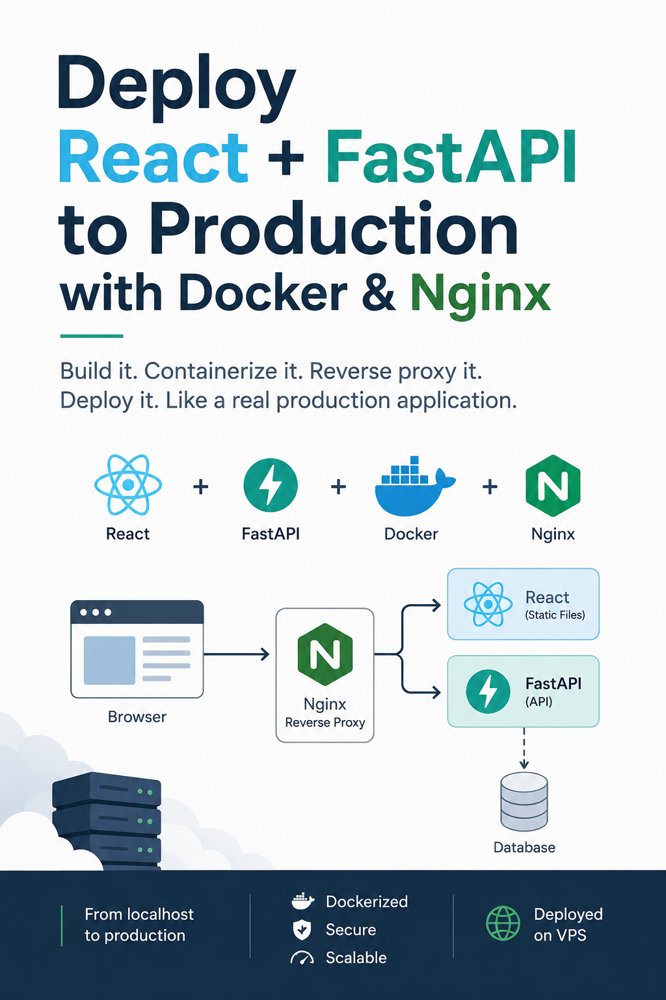

# Deploy React + FastAPI to Production with Docker & Nginx

This repository contains the source code accompanying the book **Deploy React + FastAPI to Production with Docker & Nginx**.

The book takes a practical, step-by-step approach to building and deploying a full-stack application. Starting with a simple React frontend and FastAPI backend, it gradually introduces Docker, Docker Compose, Nginx, and reverse proxying to build a production-ready architecture.

The goal is not simply to provide commands to copy and paste, but to explain **why each piece is needed and how the different components communicate with one another**.

## What You'll Build

Throughout the book, you'll build a small Task Manager application and progressively transform it into a containerized production application:

* React frontend
* FastAPI backend
* Docker containers
* Docker Compose orchestration
* Nginx serving the production React application
* Nginx reverse proxying API requests to FastAPI
* A single entry point for the complete application

By the end, you'll understand not only how to build the application, but also how the pieces fit together.

## Repository Contents

The repository contains the source code used throughout the book, organized to follow the progression of the tutorial. 

Each chapter has a corresponding tag, and introduces another part of the architecture, allowing you to follow along and reproduce the complete application yourself.

## Get the Book

The complete guide, including the explanations, diagrams, and step-by-step instructions, is available separately.

**[Purchase the book →](YOUR_BOOK_LINK_HERE)**

The book is currently planned for release through **Gumroad**. The purchase link will be updated here when it is available.

## Who Is This For?

This book is aimed at developers who want to understand how a React + FastAPI application moves from local development to a containerized production-style deployment.

You don't need to be an expert in Docker, Nginx, or React. The guide introduces each component when it becomes necessary and explains the reasoning behind the architecture.

## License

The source code in this repository is provided as a companion to the book.
The source code in this repository is licensed under the MIT License.

The book, including its text, diagrams, illustrations, and cover, is copyrighted and is not covered by the MIT License.